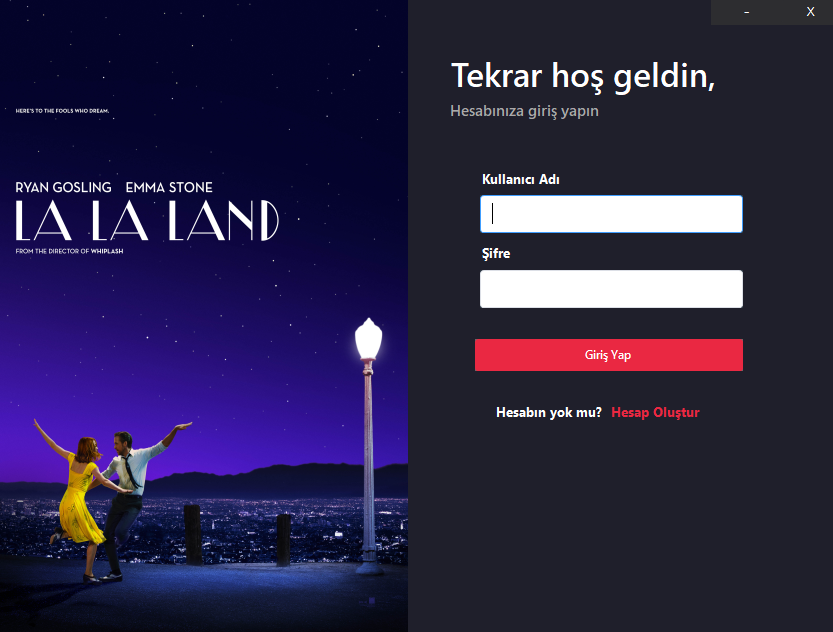
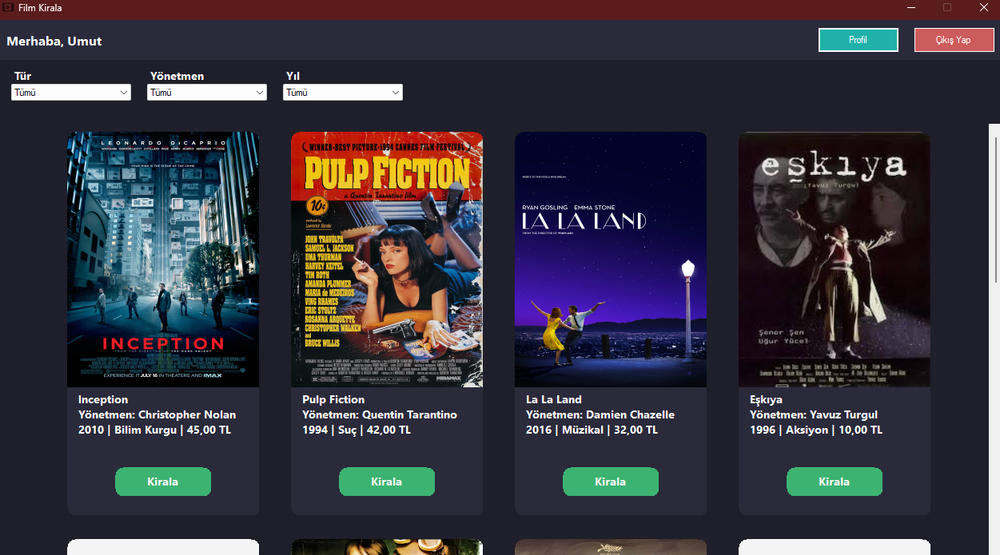
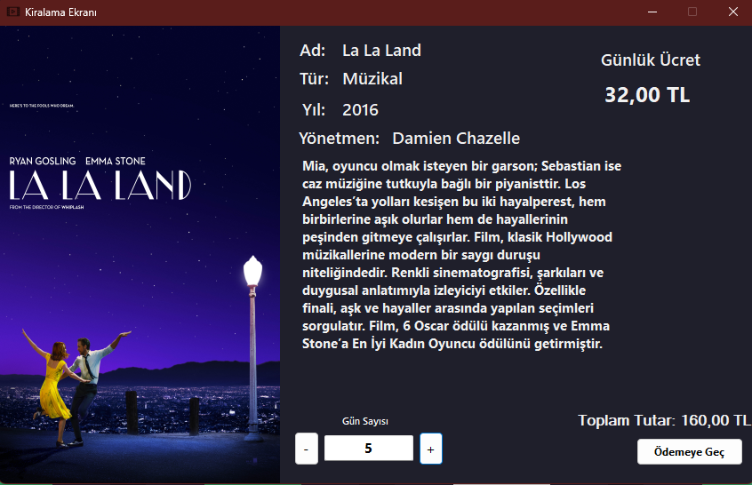
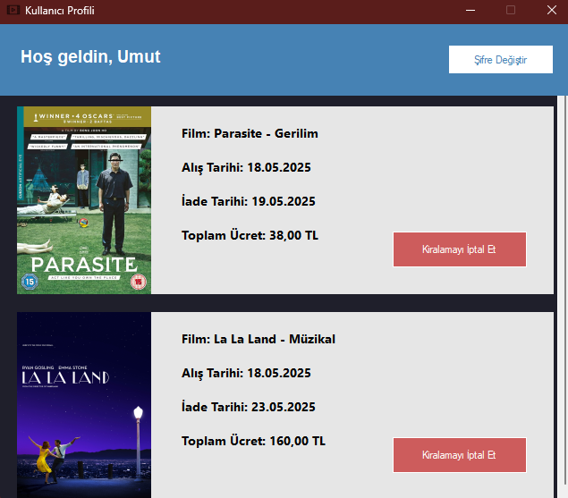
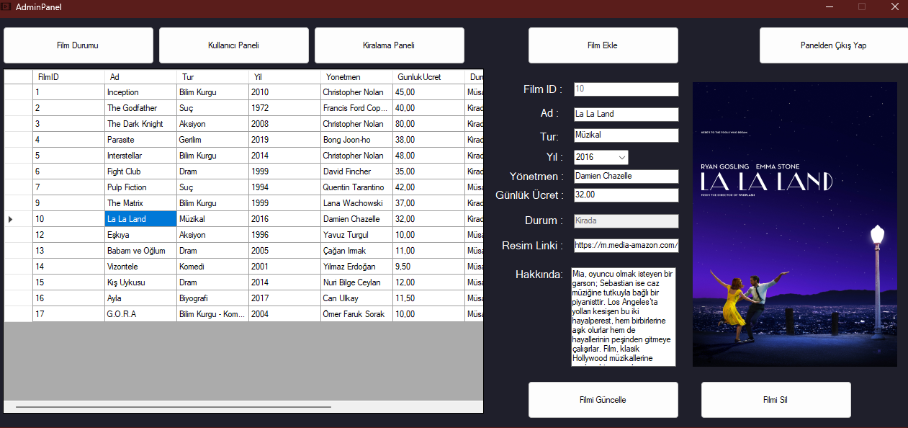
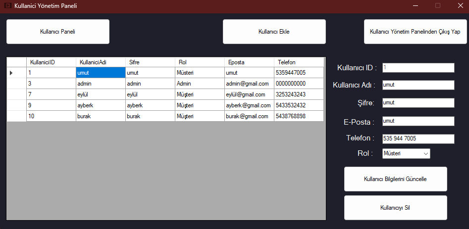
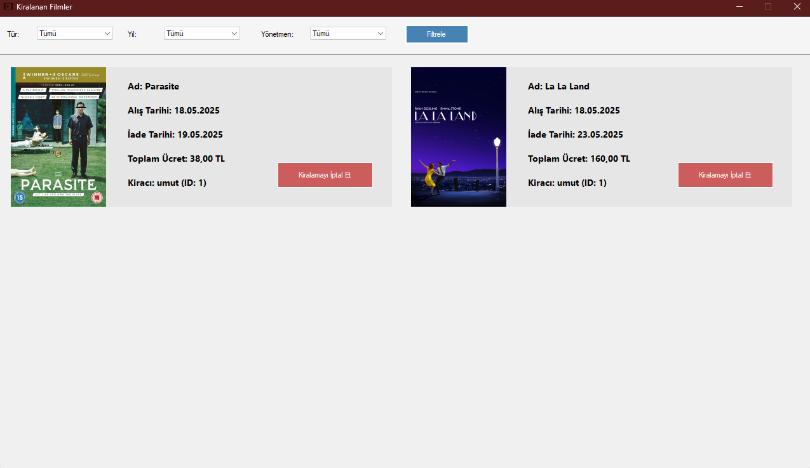

# 🎬 Film Kiralama Otomasyonu

Bu proje, C# (Windows Forms) ve SQL Server kullanılarak geliştirilmiş basit bir **Film Kiralama Otomasyonu**dur. Proje, kullanıcıların film kiralayabildiği, film listesini görüntüleyebildiği ve veritabanı üzerinde temel CRUD (Create, Read, Update, Delete) işlemlerini gerçekleştirebildiği bir yapıya sahiptir.

## 🚀 Özellikler

- 🎞️ Film listesi görüntüleme  
- ➕ Yeni film ekleme  
- ✏️ Film bilgilerini güncelleme ve silme  
- 👤 Müşteri kayıt işlemleri  
- 📅 Film kiralama ve teslim işlemleri  
- 🔌 SQL Server ile bağlantı

## 🛠️ Kullanılan Teknolojiler

- **C# (Windows Forms)**
- **.NET Framework**
- **SQL Server**
- **ADO.NET** (SqlConnection, SqlCommand vs.)

## 🔧 Veritabanı Bağlantısı

Uygulamada SQL Server bağlantısı hem `App.config` dosyasında hem de `ConnectionManager.cs` gibi sınıflarda tanımlıdır. Bu alanlarda **kendi bilgisayarınıza uygun sunucu adı (Server Name)** ve gerekli durumlarda **kullanıcı adı/parola** gibi bilgileri girmeniz gerekir.

### Bağlantı dizesi örneği:

```xml
<!-- App.config içinde -->
<connectionStrings>
  <add name="FilmKiralamaDB"
       connectionString="Server=YOUR_SERVER_NAME;Database=FilmKiralama;Trusted_Connection=True;" 
       providerName="System.Data.SqlClient"/>
</connectionStrings>
```

```csharp
// ConnectionManager.cs içinde örnek kullanım
string connectionString = "Server=YOUR_SERVER_NAME;Database=FilmKiralama;Trusted_Connection=True;";
```

> ❗ `YOUR_SERVER_NAME` kısmını kendi SQL Server örneğinizin adıyla değiştirin. Örneğin: `DESKTOP-1234\SQLEXPRESS` veya `localhost`.  
> Eğer Windows kimlik doğrulaması yerine SQL kimlik doğrulaması kullanıyorsanız bağlantı dizesi şu şekilde olabilir:  
> `Server=YOUR_SERVER_NAME;Database=FilmKiralama;User Id=sqlusername;Password=sqlpassword;`

## 📌 Kurulum

1. Bu projeyi GitHub üzerinden kendi bilgisayarınıza klonlayın:
    ```bash
    git clone https://github.com/kullaniciadi/film-kiralama-projesi.git
    ```

2. Visual Studio ile projeyi açın.

3. SQL Server'da `FilmKiralama` adlı veritabanını oluşturun ve proje içinde bulunan `FilmKiralama.sql` dosyasındaki script'i çalıştırarak tabloları oluşturun.

4. `App.config` ve `ConnectionManager.cs` dosyalarında yer alan **SQL Server bağlantı dizesini**, kendi bilgisayarınıza uygun şekilde güncelleyin.

5. Projeyi derleyin (`Ctrl+Shift+B`) ve uygulamayı çalıştırarak test edin.

## 📸 Ekran Görüntüleri


```markdown
### Giriş Ekranı


### Kiralık Filmler Ekranı


### Film Kiralama Ekranı


### Kiralanan Filmi İptal Etme (Kullanıcı)


### Admin Paneli


### Admin Kullanıcı Yönetim Paneli


### Admin Kiralık Filmler Yönetim Paneli


```

---

Teşekkürler! 😊 Projeyi faydalı bulduysanız yıldız bırakmayı unutmayın. Geliştirme sürecine katkıda bulunmak isterseniz PR (Pull Request) gönderebilirsiniz.
